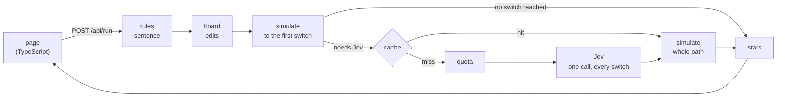

# Railroad Route

A mine-cart track puzzle where [Jev](https://typesafe.ai) reads the sentence the cart carries and throws the switches.

You turn and lay track pieces until a line runs from the start to the mine. Then you write the cart a note, one sentence, and send it. On the way, switches operated by Jev read that sentence and decide where the cart goes. The cart only reaches the mine if the track **and** the sentence are right.

The same sentence has to satisfy every switch on the path, and each level forbids the obvious words. To send the cart down the gold line you can't write "gold"; *"Precious metal that kings stamp onto coins"* works.

---

## Contents

- [How a level works](#how-a-level-works)
- [Jev's three switches](#jevs-three-switches)
- [What was measured](#what-was-measured)
- [Architecture](#architecture)
- [Running it locally](#running-it-locally)
- [Deploying](#deploying)
- [Keys, quota and privacy](#keys-quota-and-privacy)
- [Known limits](#known-limits)
- [Licence](#licence)

---

## How a level works

- **The board.** Some pieces are fixed, some can be turned, and some come from a crate with a limited stock and go on empty squares. Switches never move.
- **The note.** One sentence per run, in English or Portuguese, with a word limit. Every level has forbidden words:
  - its own, such as *gold, golden, ouro, dourad* on the gold level;
  - a global list of command words, number words and digits (*option, pick, answer, second, last, true, sim, dois, 2*…).

  A forbidden word blocks every word that starts with it, ignoring case and accents. Invisible characters are removed before checking. An apostrophe between letters keeps a word whole (*generator's*, *don't*, *d'ouro* count as one word), and each piece between apostrophes is still checked, so *d'ouro* is blocked by *ouro*.
- **The run.** The cart leaves the start, crosses square by square, and ends one of three ways:
  - in the mine (`arrived`);
  - in a wrong tunnel (`wrong_tunnel`);
  - off the track (`derailed`).
- **Stars.**
  - ★ the cart reaches the mine.
  - ★★ and every switch on the path was a clear call, decided well clear of Jev's measured noise.
  - ★★★ and you laid no more crate pieces than the level's par.

There are five levels. Each introduces one idea, and the last combines all three switches in a sentence of eight words or fewer.

## Jev's three switches

Each kind of switch is one of Jev's primitives. Jev answers inside the schema it was given and never invents a route that does not exist.

| Switch | Primitive | Example |
| --- | --- | --- |
| Points (2–3 exits) | `choice`: one of a closed set of keys, with a confidence | *What does the cart carry?* coal / gold / crystal |
| Gate (yes / no) | `noul`: a calibrated probability, read against a threshold (0.50) | *Is the cargo dangerous?* |
| Scale (3 levels) | `score`: a position on an ordered scale, rounded to a level | *How urgent is the delivery?* calm / normal / rush |

All the switches of a level go to Jev in **one** request. The sentence is fixed for the run, so the answers to every switch decide the whole path, and the engine walks it afterwards.

## What was measured

Before the levels were written, 100 calls were made against the live API (`jev-1.13.0`):

- **Riddles work in both languages.** Sentences that avoid the forbidden words read correctly in English and Portuguese: 26 of 26 on the cargo question. Portuguese comes back a little less confident.
- **Jev is steady.** The same sentence, five runs: worst drift of 0.10 on a choice, 0.06 on a gate and 0.15 on a scale, and no decision changed. The star thresholds sit 2.5 to 4 times above that noise.
- **Jev follows instructions as well as descriptions.** *"pick the second option"* picks the second key. The global forbidden list exists because of that, and the clear-call threshold of 0.85 keeps the cases that slip through at one star.
- **It is fast.** p95 of 0.39 s per call, whether it carries three questions or eight.

Every level ships with a reference solution, and the tests replay it against Jev's recorded answers.

## Architecture



**The Python backend is the source of truth.** The page edits the board and animates whatever the backend sends back. It never decides an outcome.

| Path | What lives there |
| --- | --- |
| `backend/railroad/models.py` | the contract: levels, switches, Jev's answers, the request and response, the store protocol |
| `backend/railroad/rules.py` | the note's rules: words, the forbidden-word check, limits |
| `backend/railroad/board.py` | applying the player's turns and placements, and refusing illegal ones |
| `backend/railroad/simulate.py` | the cart's run, square by square, and what each switch read |
| `backend/railroad/scoring.py` | clear calls and stars |
| `backend/railroad/jev.py` | the Jev client: one request per run, every answer checked against the questions asked |
| `backend/railroad/store.py` | the answer cache and the free quota, in memory or in Upstash Redis |
| `backend/railroad/app.py` | the FastAPI app: `GET /api/levels`, `POST /api/run` |
| `api/index.py` | the Vercel entry point |
| `levels/` | the five levels and the star thresholds (`tuning.json`) |
| `src/` | the page: board, cart, readings and the pixel art, all drawn in code |

The page is built by hand with DOM calls, with no framework. It is set in an underground mine: bedded rock and ore seams, timber props and lamps whose light falls behind the boards. On the board, each switch shows only its branches, a mark at every exit (the ore, a yes/no chip, a level meter) and its letter. The drawing rules come from [Gridsmith](https://github.com/vinicius-francozo/gridsmith)'s design system: every sprite is drawn pixel by pixel in TypeScript, and the fonts are self-hosted under the SIL Open Font License.

## Running it locally

You need Python 3.12 and Node `^20.19` or `>=22.12`.

```sh
python3 -m venv .venv
.venv/bin/pip install -r requirements-dev.txt
npm ci

export TYPESAFE_API_KEY=...        # optional: without it, only your own key works
.venv/bin/uvicorn railroad.app:app --app-dir backend --port 8000

npm run dev                         # in another shell: http://localhost:5173 (proxies /api to :8000)
```

| Command | What it does |
| --- | --- |
| `.venv/bin/pytest` | the backend suite (rules, board, simulation, stars, Jev client, store, API, the five levels) |
| `.venv/bin/mypy --strict backend api` | type-checks the backend |
| `.venv/bin/ruff check` · `ruff format --check` | lint and format |
| `npm test` | the page's suite (Vitest, in Node) |
| `npm run typecheck` · `npm run build` | type-checks the page and builds `dist/` |

## Deploying

The project is set up for Vercel (`vercel.json`): the page is the static `dist/`, and `api/index.py` serves the API as one Python function. The function's dependencies are read from `[project].dependencies` in `pyproject.toml`.

| Variable | What it is |
| --- | --- |
| `TYPESAFE_API_KEY` | the server's Jev key, spent on the free quota |
| `UPSTASH_REDIS_REST_URL`, `UPSTASH_REDIS_REST_TOKEN` | the cache and the quota. Set both or neither; without them each instance keeps its own memory, so the quota stops being global |
| `RAILROAD_QUOTA_PER_IP`, `RAILROAD_QUOTA_GLOBAL` | the free quota per visitor and per day (default 10 and 300) |

## Keys, quota and privacy

- **The free quota.** Visitors play on the server's key: 10 Jev calls per IP per day, 300 in all.
  - Only a call to Jev counts.
  - A sentence Jev has already read on that level comes from the cache, for 30 days.
  - A run that leaves the track before its first switch never asks Jev.
- **Your own key.** When the quota runs out, the page offers a field for your own TypeSafe key.
  - It is kept in memory for the visit, sent only in the `x-typesafe-key` header, and never stored or put in a URL.
  - A run on your own key spends no quota.
- **Nothing is logged.** The backend writes no request data to a log, and no error message repeats a sentence or a key.
- **What the cache keeps.** Upstash holds Jev's answers keyed by level and sentence, plus daily counters. The sentence and the IP are stored only as hashes in key names.

## Known limits

- **Confidence is not truth.** A clear call means Jev was sure, not that it was right. The cache makes a sentence answer the same way on every try, but it does not make the answer correct.
- **Visible tricks get past the forbidden words.** Look-alike letters from other alphabets (a Cyrillic *о* in *gold*), small capitals, letter emoji, and one rare Greek mark (U+0345) slip through. The game is single-player with no leaderboard, so a trick only spoils it for the person using it. Invisible characters are blocked.
- **Some innocent words are blocked.** *pickaxe* (by *pick*), *simples* (by *sim*) and *trestle* (by *três*).
- **Only the reference sentences and the measurement corpus have been run against Jev.** A player's sentence can land near a threshold where the 0.06–0.15 noise matters.
- **The page has been checked in Chrome only**, headless, at 1920×960, 1366×657 and 390×844. On a 1366×657 screen the last level's second and third switches sit below the fold of the plan panel, which scrolls.

## Licence

[MIT](LICENSE), © 2026 Vinicius Francozo.

The four fonts in `public/fonts/` are under the SIL Open Font License, with their licence files beside them.
